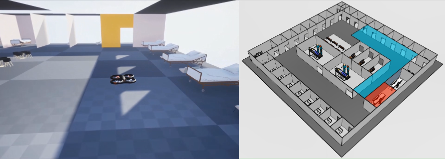
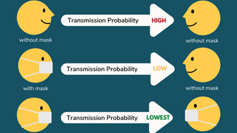
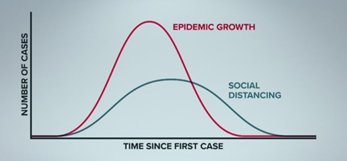
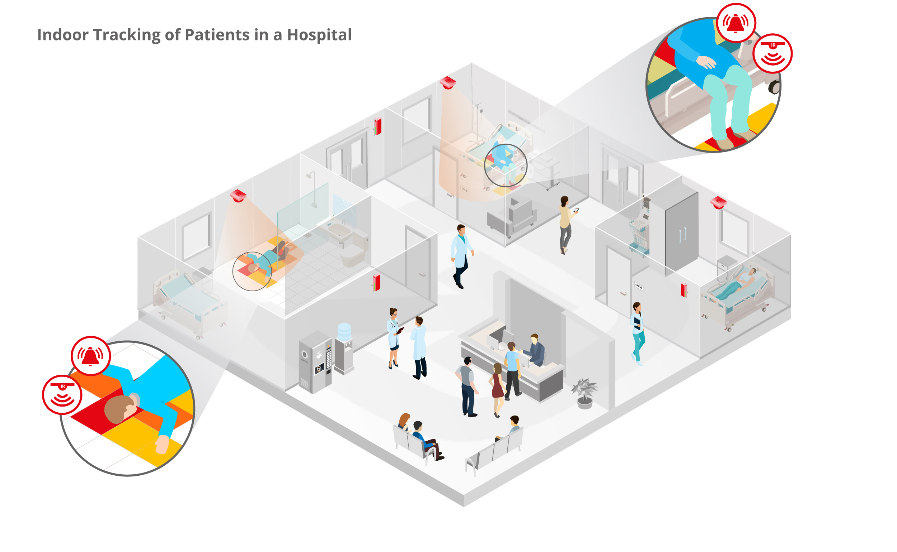
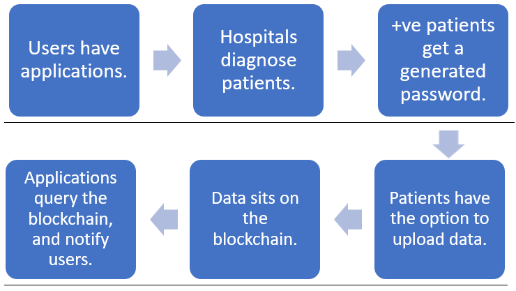

# Hospital of the future - Contoso Healthcare

<!-- PROJECT LOGO -->
 

    
  </a>
  
  

    Our vision of Hospital-of-the-future to Reimagine Healthcare
  

## Table of Contents

* [About the Project](#about-the-project)
  * [Digital Twin](#digital-twin)
  * [Drone](#drone)
  * [Computer vision](#computer-vision)
  * [Geriatrics](#geriatrics)
  * [Blockchain](#blockchain)

## About The Project

### Digital Twin
**Problem statement:** The aim is to build a digital twin of the hospital premises. 

**Problem Description:** Digital Twins have become increasingly popular in the last few years because of their capabilities of influencing design build operations. Digital twin refers to a digital replica of assets in the building, the various rooms and sensors among other entities.  
In our case, building a digital twin of the hospital will help create an environment, which can be controlled by the user and provides additional Insights for effective operation of edge devices. In this context, edge devices refer to the drone and the conversational chat bot.  
There is need to monitor the data from sensors, such as the occupancy sensors, temperature sensors, energy consumption, etc. across the building to get an insight into the various factors affecting the facility, which can effectively be provided by the digital twin.

[Go to solution](https://github.com/Rohan-Deshamudre/Drone-nav)

### Drone
**Problem statement:** Enabling drone navigation inside a hospital for surveillance and routing between areas of the facility.

**Problem Description:** In a world where healthcare workers are being overworked and a shortage of over 14 million healthcare workers is predicted by 2030, providing assistance via the means of technology is the responsibility of software developers. An edge device that acts as an assistant is required to reduce the burden of hospital staff as well as provide personal attention to patients which helps increase customer satisfaction rates.  

**Suggested Solution:** Have a drone for:
1. Autonomous navigation through the hospital facility to guide patients to different areas of the facility
2. The drone can be used for surveillance of the hospital facility. We can use its powerful sensors and camera to monitor things such as PPE and social distancing compliance for which we have created computer vision models.
3. Use the drone to help the staff locate equipment such the closest wheelchair or stretcher using asset tracking which can be enabled through the Azure Digital Twin of the hospital.

[Go to solution](https://github.com/Rohan-Deshamudre/Drone-nav)

### Computer vision
**Problem Statement:** The aim is to develop containerized computer vision models for the detection of people violating health protocols and deploy them on edge devices. These edge devices could either be drones or just a regular camera connected to a micro-computer.

**Suggested Solution:** To build and deploy three computer vision models for the following problems:	
1. Mask Compliance -  To detect if people within the field of view are wearing a face mask.\

2. People Counting - To count the number of people within the field of view.
3. Proximity Sensing and Social Distancing - To detect if people within the field of view are maintaining appropriate distance between each other.\

[Go to solution](https://github.com/Rohan-Deshamudre/Drone-nav)

### Geriatrics
**Problem Statement:** Enable fall Detection and to detect if an elderly person got out of the bed.

**Problem Description:** It is a well known fact that the common issue in the medical industry for senior citizens is that their health deteriorates after a fall. Predicting such a fall would preventing further damages to their health. Also, under the current unprecedented circumstances, it is difficult for the staff of various medical centres to constantly monitor the patients. 

 https://bit.ly/3krnbAU 

[Go to solution](https://github.com/Rohan-Deshamudre/Drone-nav)
### Blockchain
**Problem Statement:** Open-ended problem statement on exploring Blockchain technology as a possible, viable solution for contact tracing. 

**Problem Description:** 
Contact Tracing has traditionally been done manually, and is both manpower intensive and not very reliable. CoVid-19 accelerated the adoption of digital solutions, but today's digital solutions are not ideal, for reasons such as: 
1. They do not practice the lean data collection protocol, 
2. Data is stored on central servers, and if the server faces issues, the entire digital solution structure falls apart. Moreover, every solution developed today is limited to a geographical boundary. 

These are just a few of the problems plaguing the wide-spread adoption of digital contract tracing solutions.

**Suggested Solution:** Blockchain can play a major role, due to its characteristic features, which are:
1. Decentralization of data 
2. Immutability

Our suggested solution is as an application. The workflow is as follows: 

[Go to solution](https://github.com/Rohan-Deshamudre/Drone-nav)
